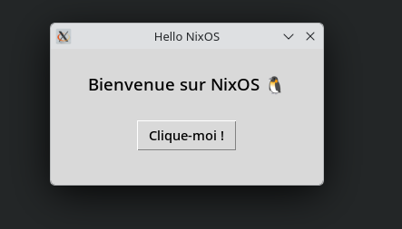

# Exercise 8: Building a package

## The package

Please see the package source files in the `files/` directory.

All the build logic lives in `default.nix`, and it is called from `flake.nix` — just as we have seen in previous exercises.

```bash
nix build    # compile and install into ./result/
nix run      # run directly without installing
nix develop  # open a dev shell with python3 available
```

---

## Good practices: why `flake.nix` calls `default.nix`, and not the other way around

You might notice that both files seem to be involved in building the same thing. This is intentional — they have distinct, complementary roles.

### `default.nix` — the package definition

`default.nix` describes **how to build the program**. It is a pure function: it receives its dependencies (`lib`, `python3`, `imagemagick`, `makeWrapper`) as injected parameters via `callPackage`, and returns a derivation. It knows nothing about where nixpkgs comes from, which version is used, or what flake is calling it.

```
default.nix
  ↳ "given these tools, here is how to build hello-nix"
```

Because it is self-contained and dependency-agnostic, it is **reusable**: any flake, any project, any `configuration.nix` can call it directly via `pkgs.callPackage ./default.nix {}` without knowing anything about your `flake.nix`.

### `flake.nix` — the entry point and wiring layer

`flake.nix` is the **infrastructure layer**. It owns the inputs (which version of nixpkgs to use), selects the target architecture, and wires everything together. Its job is to call `default.nix` with the right context — it does not define the build logic itself.

```
flake.nix
  ↳ "import nixpkgs at this version, for this architecture, then call default.nix"
```

### Why this direction and not the reverse?

If `default.nix` imported `flake.nix` instead, it would become tightly coupled to a specific flake — meaning it could no longer be reused independently. You would not be able to call it from `configuration.nix`, from another project, or from the command line via `nix-build`. The package definition would be stuck inside one specific entry point.

The rule of thumb is:

> **Entry points call package definitions. Package definitions never call entry points.**

This is the same principle as in any programming language: your `main()` calls your functions, your functions do not call `main()`.

| | `default.nix` | `flake.nix` |
|---|---|---|
| Role | Package definition | Entry point / wiring |
| Knows about nixpkgs version? | No | Yes |
| Reusable by other projects? | Yes | No |
| Contains build logic? | Yes | No |
| Calls the other? | No | Yes |

---

## Installing the package locally

Until now we have added packages through:

```nix
# /etc/nixos/configuration.nix
environment.systemPackages = [
  pkgs.git
];
```

This is clean and simple, but it only works for packages already in the official `nixpkgs` repository — which is obviously not the case for a package you just wrote yourself.

Let's place our program in a dedicated location:

```
/home/user/homework/hello/
-rw------- 1 user users 1692 24 mai 08:25 default.nix
-rw-r--r-- 1 user users  567 24 mai 08:31 flake.lock
-rw------- 1 user users  618 24 mai 06:16 flake.nix
-rw------- 1 user users  149 24 mai 06:16 hello-nix.desktop
-rw------- 1 user users 1605 24 mai 06:16 hello-nix.tar.gz
-rw------- 1 user users  450 24 mai 06:16 hello.py
-rw-r--r-- 1 user users 1271 24 mai 08:30 icon.svg
```

To install it system-wide, reference it via `callPackage` in `configuration.nix`:

```nix
# /etc/nixos/configuration.nix
environment.systemPackages = [
  (pkgs.callPackage /home/user/homework/hello/default.nix {})
];
```

Then rebuild:

```bash
nixos-rebuild switch
```

Then run it:

```bash
hello-nix
```



> ℹ️ **Want to try the program locally without installing it?** The simplest way is:
> ```bash
> nix build
> nix run
> ```
> Or if you want an interactive dev shell with Python available:
> ```bash
> nix develop
> python3 hello.py
> ```

---

## Making the package available from GitHub

Now that you have your package `hello-nix`, let's make it publicly available by distributing it through GitHub:

[https://github.com/cbid71/initiation_nixos_ex_package_demo.git](https://github.com/cbid71/initiation_nixos_ex_package_demo.git)

> ⚠️ Don't forget to include the `flake.lock` file generated during `nix build` — it pins the exact version of nixpkgs used, which is essential for reproducibility.

The root of the repository must contain:

```
ls -l
total 24
-rw------- 1 user users 1705 24 mai 08:55 default.nix
-rw-r--r-- 1 user users  567 24 mai 08:31 flake.lock
-rw------- 1 user users  618 24 mai 06:16 flake.nix
-rw------- 1 user users  149 24 mai 06:16 hello-nix.desktop
-rw------- 1 user users  450 24 mai 06:16 hello.py
-rw-r--r-- 1 user users 1271 24 mai 08:30 icon.svg
```

You can now install the package in three different ways:

---

### Method 1 — `nix profile` (quick, but less "NixOS-spirited")

```bash
# Install
nix profile install github:cbid71/initiation_nixos_ex_package_demo
hello-nix

# Uninstall
nix profile list
# Find the entry named "initiation_nixos_ex_package_demo", then:
nix profile remove initiation_nixos_ex_package_demo
```

This works immediately but bypasses the declarative system — if you rebuild your NixOS configuration, this installation will not be remembered. It is handy for quick testing, but not recommended for permanent installation.

---

### Method 2 — `configuration.nix` with `fetchGit` (declarative)

```nix
# /etc/nixos/configuration.nix
environment.systemPackages = [
  (pkgs.callPackage (builtins.fetchGit {
    url = "github:cbid71/initiation_nixos_ex_package_demo";
    ref = "main";
  }) {})
];
```

Then:

```bash
nixos-rebuild switch
hello-nix

# To uninstall: remove the lines above from configuration.nix and rebuild
```

This is fully declarative and reproducible. The downside is that nixpkgs version pinning comes from your system's `flake.lock`, not the package's own.

Documentation associated : https://noogle.dev/f/builtins/fetchGit/

---

### Method 3 — system `flake.nix` (most "NixOS-spirited")

If your NixOS configuration is already managed as a flake, you can add the package as a flake input:

```nix
# /etc/nixos/flake.nix
{
  inputs = {
    nixpkgs.url     = "github:NixOS/nixpkgs/nixos-unstable";
    hello-nix.url   = "github:cbid71/initiation_nixos_ex_package_demo";
  };

  outputs = { self, nixpkgs, hello-nix }: {
    nixosConfigurations.your-hostname = nixpkgs.lib.nixosSystem {
      system = "x86_64-linux";
      modules = [{
        environment.systemPackages = [
          hello-nix.packages.x86_64-linux.default
        ];
      }];
    };
  };
}
```

Then:

```bash
sudo nixos-rebuild switch
hello-nix
```

This is the most reproducible and idiomatic approach — both your system and the package have their versions pinned in `flake.lock`.